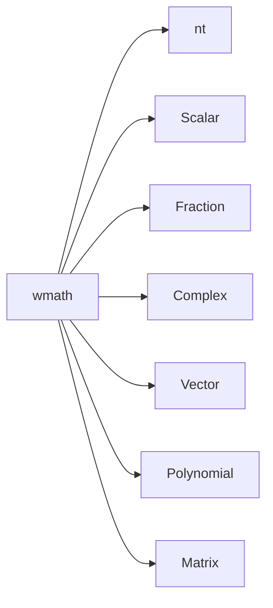

# introduction
'**wmathjs**' is a simple mathematical package. 


## Features

- '**Scalar**' and '**Vector**' are two main class in wmathjs. 
- '**Scalar**' includes '**Fraction**', '**Complex**' and built-in '**Number**' up to now. 
- '**Vector**' includes '**Polynomial**' and '**Matrix**' up to now. 
- You can create your own class derived from '**Scalar**' and define some calculation rules between it and other Scalar class existed already or not if you are sure there is not possible operations between it and some Scalar class. [Learn how to create a new Scalar class](#Learn_how_to_create_a_new_Scalar_class)
- You can also create your own class derived from '**Vector**' and define the calculation rules. [Learn how to create a new Vector class](#Learn_how_to_create_a_new_Vector_class)


## Namespace

You can use below codes to require wmathjs completely. 

```javascript
const wmath = require('@wang606/wmathjs'); 
wmath.init(); 
```

And then you have all items in `wmath`. 

Here is the entire namespace:




## Quick Start

```js
const wmath = require('@wang606/wmathjs'); 
wmath.init(); 
wmath.Scalar.precision = 1e-12; // default 1e-10
...[TODO]
```


## Reference

[click me](./REFERENCE.md)


## <span id="Learn_how_to_create_a_new_Scalar_class">Learn how to create a new Scalar class</span>

For example, if you want to create a new class derived from Scalar called '**Triple**' like that:

```js
class Triple extends wmath.Scalar {
    constructor(r, i, j) {
        this.r = r; 
        this.i = i; 
        this.j = j; 
    }
    /* there must be 'typeName' and 'static typeName' function to return the class name correctly. */
    typeName() { return "Triple"; }
    static typeName() { return "Triple"; }
}
```

Then you could define some anonymous functions to make it match with Scalar. Such as:

```js
/* convert other Scalar class to Triple */
Scalar.to_.Number0to0Triple = (a, b) => { ... }
// Scalar.to_.Number0to0Triple = (a, b) => { return new Triple(a, 0, 0); }
Scalar.to_Fraction0to0Triple = (a, b) => { ... }
// Scalar.to_.Fraction0to0Triple = (a, b) => { return new Triple(a.toNumber(), 0, 0)}
Scalar.to_Complex0to0Triple = (a, b) => { ... }
// Scalar.to_.Complex0to0Triple = (a, b) => { return new Triple(a.real, a.imag, 0); }
/* convert Triple to other Scalar */
Scalar.to_.Triple0to0Number = (a, b) => { ... }
// Scalar.to_.Triple0to0Number = (a, b) => { if (a.i == 0 && a.j == 0) return a.r; else throw "can't convert Triple to Number !"; }
Scalar.to_.Triple0to0Fraction = (a, b) => { ... }
// Scalar.to_.Triple0to0Fraction = (a, b) => { if (a.i == 0 && a.j == 0) return new wmath.Fraction(a.r); else throw "can't convert Triple to Fraction !"; }
Scalar.to_.Triple0to0Complex = (a, b) => { ... }
// Scalar.to_.Triple0to0Complex = (a, b) => { if (a.j == 0) return new wmath.Complex(a.r, a.i); else throw "can't convert Triple to Complex !"; }
```

It looks messy indeed, but useful and necessary in my mind. (*If you have a better idea, I would appreciate it if you could tell me. wang__qing__hua@163.com*)

After that, you can use `Scalar.to(a: Scalar, Triple)` to convert any Scalar data to **Triple**, and use the same function `Scalar.to(a: Triple, b: Scalar)` to convert **Triple** to any other class based on Scalar. 

Similar functions are below:

```js
/* unary operator */
Scalar.equal_.Triple = (a, b) => { ... }
// callback when call `Scalar.equal(a: Triple, b: Triple)`
Scalar.deepcopy_.Triple = (a) => { ... }
// callback when call `Scalar.deepcopy(a: Triple)`
Scalar.abs_.Triple = (a) => { ... }
// callback when call `Scalar.abs(a: Triple)`
Scalar.positive_.Triple = (a) => { ... }
// callback when call `Scalar.positive(a: Triple)`
Scalar.negative_.Triple = (a) => { ... }
// callback when call `Scalar.negative(a: Triple)`
Scalar.reciprocal_.Triple = (a) => { ... }
// callback when call `Scalar.reciprocal(a: Triple)`
Scalar.conjugate_.Triple = (a) => { ... }
// callback when call `Scalar.conjugate(a: Triple)`
Scalar.log_.Triple = (a) => { ... }
// callback when call `Scalar.log(a: Triple)`
Scalar.one_.Triple = (a) => { ... }
// callback when call `Scalar.one(a: Triple)`
Scalar.zero_.Triple = (a) => { ... }
// callback when call `Scalar.zero(a: Triple)`
Scalar.similarOne_.Triple = (a) => { ... }
// callback when call `Scalar.similarOne(a: Triple)`
Scalar.similarZero_.Triple = (a) => { ... }
// callback when call `Scalar.similarZero(a: Triple)`
Scalar.equalOne_.Triple = (a) => { ... }
// callback when call `Scalar.equalOne(a: Triple)`
Scalar.equalZero_.Triple = (a) => { ... }
// callback when call `Scalar.equalZero(a: Triple)`
Scalar.latex_.Triple = (a) => { ... }
// callback when call `Scalar.latex(a: Triple)`

/* operator between Triple and other Scalar */
/* this part is similar to `Scalar.to_` */
Scalar.add_.Number0add0Triple = (a: Number, b: Triple) => { ... }
// callback when call `Scalar.add(a: Number, b: Triple)`
...
Scalar.sub_.Fraction0sub0Triple = (a: wmath.Fraction, b: Triple) => { ... }
// callback when call `Scalar.sub(a: wmath.Fraction, b: Triple)`
...
Scalar.mul_.Complex0mul0Triple = (a: wmath.Complex, b: Triple) => { ... }
// callback when call `Scalar.mul(a: wmath.Complex, b: Triple)`
...
Scalar.div_.Triple0div0Number = (a: Triple, b: Number) => { ... }
// callback when call `Scalar.div(a: Triple, b: Number)`
...
Scalar.pow_.Triple0pow0Triple = (a: Triple, b: Triple) => { ... }
// callback when call `Scalar.pow(a: Triple, b: Triple)`
...
```

After that, you can use operator in `Scalar` to operate Triple completely!

If some operators are unlikely to be used, such as `Scalar.pow(a: Number, b: Triple)`, There is no need to define corresponding functions under `Scalar`, such as `Scalar.pow_.Number0pow0Triple`. 

## <span id="Learn_how_to_create_a_new_Vector_class">Learn how to create a new Vector class</span>

See [Learn how to create a new Scalar class](Learn_how_to_create_a_new_Scalar_class). 

Replace `Scalar` to `Vector`. :sweat_smile:

And the main differences is that classes controlled by **Vector** are **Scalar**, **Polynomial** and **Matrix** up to now, while **Scalar** includes **Number**, **Fraction** and **Complex**. In this view, **Scalar** is a part of **Vector** as a unit. 

All operators in `Scalar` can be replaced by operators in `Vector`. When arguments are `Scalar`, operators in `Vector` would call corresponding operators in `Scalar`. 